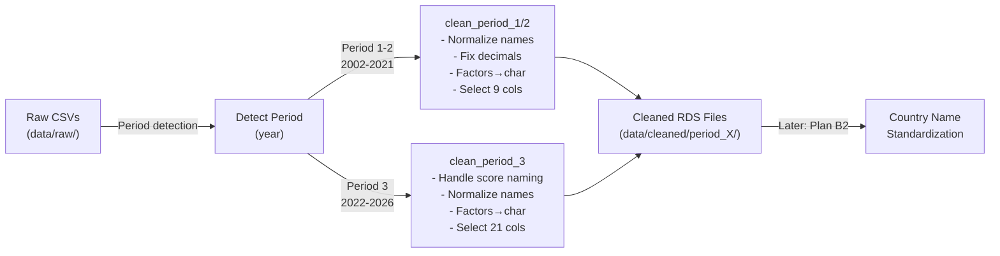

# Plan B1: Column Name Normalization Across Periods

**Date:** Monday, July 27, 2026  
**Project:** pressfreedom.data R Package  
**Phase:** Cleaning Phase — Part 1 of 2  
**Objective:** Normalize column names across all three periods to match the target database structure (character data types, not factors)

---

## Overview

**Plan B1** focuses exclusively on column name normalization and data type conversion (factors → character) to achieve a consistent structure as defined in `dev/rwb-structure.csv`.

**Plan B2** (separate document) will handle:
- Country name standardization
- Special case handling (Taiwan, Kosovo, etc.)
- Additional data quality transformations

---

## Target Structure (from dev/rwb-structure.csv)

**Total: 20 columns**

| Column | Data Type | Notes |
|--------|-----------|-------|
| `year_n` | numeric | Year of publication |
| `iso` | **character** | ISO 3166-1 alpha-3 code (convert factor → character) |
| `country_en` | **character** | English country name (convert factor → character) |
| `score` | numeric | Overall press freedom score |
| `rank` | numeric | Overall rank in that year |
| `political_context` | numeric | Political dimension score |
| `rank_pol` | numeric | Political dimension rank |
| `economic_context` | numeric | Economic dimension score |
| `rank_eco` | numeric | Economic dimension rank |
| `legal_context` | numeric | Legal dimension score |
| `rank_leg` | numeric | Legal dimension rank |
| `social_context` | numeric | Social dimension score |
| `rank_soc` | numeric | Social dimension rank |
| `safety` | numeric | Safety dimension score |
| `rank_saf` | numeric | Safety dimension rank |
| `zone` | **character** | Geographic zone (convert factor → character) |
| `rank_n_1` | numeric | Previous year's rank |
| `rank_evolution` | numeric | Rank change from previous year |
| `score_n_1` | numeric | Previous year's score (NA for Period 1–2 and 2022) |
| `score_evolution` | numeric | Score change from previous year (NA for Period 1–2 and 2022) |

**Key Differences from Original:**
- Factors → character (iso, country_en, zone)
- `Year (N)` → `year_n`
- `Rank N` → `rank`
- `Score N` (or `Score YYYY` in 2025–2026) → `score`
- `Rank N-1` → `rank_n_1`
- `Score N-1` → `score_n_1` (available since 2023)
- `Rank evolution` → `rank_evolution`
- `Score evolution` → `score_evolution` (available since 2023)
- Multiple language columns (FR, ES, AR, FA, PT) → Keep only `country_en`
- Drop `Situation` column (appeared in 2024, not in target structure)
- All dimension columns retain lowercase snake_case naming

---

## Current Column Structure by Period

### Period 1: 2002–2012
**Source File:** `rwb2002.csv` (example)

**Raw Columns (16 total):**
1. `Year (N)` → `year_n`
2. `ISO` → `iso`
3. `Rank N` → `rank`
4. `Score N` → `score`
5. `Score N without the exactions` → **DROP**
6. `Score N with the exactions` → **DROP**
7. `Score exactions` → **DROP**
8. `Rank N-1` → `rank_n_1`
9. `Score N-1` → `score_n_1`
10. `Rank evolution` → `rank_evolution`
11. `FR_country` → **DROP** (keep only EN)
12. `EN_country` → `country_en`
13. `ES_country` → **DROP**
14. `AR_country` → **DROP**
15. `FA_country` → **DROP**
16. `Zone` → `zone`

**Output Columns (20 total — unified with Period 3):**
- Base columns: `year_n`, `iso`, `country_en`, `score`, `rank`, `zone`, `rank_n_1`, `rank_evolution`
- Dimension columns (all NA): `political_context`, `rank_pol`, `economic_context`, `rank_eco`, `legal_context`, `rank_leg`, `social_context`, `rank_soc`, `safety`, `rank_saf`
- Score history (all NA for Period 1–2): `score_n_1`, `score_evolution`

---

### Period 2: 2013–2021
**Source File:** `rwb2013.csv` (example)

**Raw Columns (16 total):** Identical to Period 1

**Output Columns (20 total — unified with Periods 1 & 3):** Same as Period 1 (base 8 columns + 10 dimension columns as NA + 2 score history columns as NA)

---

### Period 3: 2022–2026
**Source Files:** `rwb2022.csv`, `rwb2023.csv`, `rwb2024.csv`, `rwb2025.csv`, `rwb2026.csv` (varying column orders and availability)

**Key Variations:**
- **2022:** No `Score N-1`, `Score evolution`; no `Country_PT`; no `Situation` column
- **2023:** Adds `Score N-1`, `Score evolution`; adds `Country_PT`
- **2024:** Adds `Situation` column (between `Rank_Saf` and `Zone`)
- **2025:** Renames `Score` → `Score 2025` (year-specific)
- **2026:** Renames `Score` → `Score 2026` (year-specific)

**Raw Columns to Map (20 target columns):**

| # | Source Column | Target Column | Notes |
|---|---------------|---------------|-------|
| 1 | `ISO` | `iso` | Present in all years |
| 2 | `Score` / `Score YYYY` | `score` | Rename year-specific to generic |
| 3 | `Rank` | `rank` | Present in all years |
| 4 | `Political Context` | `political_context` | Present in all years |
| 5 | `Rank_Pol` | `rank_pol` | Present in all years |
| 6 | `Economic Context` | `economic_context` | Present in all years |
| 7 | `Rank_Eco` | `rank_eco` | Present in all years |
| 8 | `Legal Context` | `legal_context` | Present in all years |
| 9 | `Rank_Leg` | `rank_leg` | Present in all years |
| 10 | `Social Context` | `social_context` | Present in all years |
| 11 | `Rank_Soc` | `rank_soc` | Present in all years |
| 12 | `Safety` | `safety` | Present in all years |
| 13 | `Rank_Saf` | `rank_saf` | Present in all years |
| 14 | `Zone` | `zone` | Present in all years |
| 15 | `Country_EN` | `country_en` | Keep only EN (drop FR, ES, AR, FA, PT) |
| 16 | `Year (N)` | `year_n` | Present in all years |
| 17 | `Rank N-1` | `rank_n_1` | Present in all years |
| 18 | `Rank evolution` | `rank_evolution` | Present in all years |
| 19 | `Score N-1` | `score_n_1` | Added in 2023 (NA for 2022) |
| 20 | `Score evolution` | `score_evolution` | Added in 2023 (NA for 2022) |

**Columns to DROP:**
- `Situation` (2024+) — not in target structure
- `Country_FR`, `Country_ES`, `Country_PT`, `Country_AR`, `Country_FA` — all non-English language variants

**Output Columns (20 total):**
- All 20 columns defined in target structure, including dimensions

---

## Implementation Plan

### Step 1: Create Mapping Configuration File
**File:** `R/column_mappings.R`

Define explicit column mappings for each period to handle:
- Column name variations across years
- Language columns (drop all except English)
- Year-specific score naming (e.g., `Score 2026` → `score`)
- Snake_case normalization for dimension columns

**Content:**
```r
# Define mappings for Period 1 & 2 (identical)
PERIOD_1_2_MAPPINGS <- list(
  "Year (N)" = "year_n",
  "ISO" = "iso",
  "Rank N" = "rank",
  "Score N" = "score",
  "Rank N-1" = "rank_n_1",
  "Score N-1" = "score_n_1",
  "Rank evolution" = "rank_evolution",
  "EN_country" = "country_en",
  "Zone" = "zone"
  # All other columns should be dropped
)

# Define mappings for Period 3 (2022+)
# Note: Handles both rwb2022.csv (Score) and rwb2026.csv (Score 2026)
PERIOD_3_MAPPINGS <- list(
  "ISO" = "iso",
  # Score can be "Score" or "Score YYYY"
  "Rank" = "rank",
  "Political Context" = "political_context",
  "Rank_Pol" = "rank_pol",
  "Economic Context" = "economic_context",
  "Rank_Eco" = "rank_eco",
  "Legal Context" = "legal_context",
  "Rank_Leg" = "rank_leg",
  "Social Context" = "social_context",
  "Rank_Soc" = "rank_soc",
  "Safety" = "safety",
  "Rank_Saf" = "rank_saf",
  "Zone" = "zone",
  "Country_EN" = "country_en",
  "Year (N)" = "year_n",
  "Rank N-1" = "rank_n_1",
  "Rank evolution" = "rank_evolution",
  "Score N-1" = "score_n_1",
  "Score evolution" = "score_evolution"
  # All other columns should be dropped
)
```

---

### Step 2: Enhance Utility Functions
**File:** `R/utils.R`

Add helper functions:

1. **`normalize_column_names(df, period)`**
   - Input: Raw data frame + period identifier
   - Applies period-specific column mappings
   - Handles year-specific score naming (2026 issue)
   - Returns data frame with normalized column names

2. **`standardize_decimal_separators(df, period)`**
   - Input: Data frame with score columns
   - Period 1–2: Convert comma decimals (`,`) to periods (`.`)
   - Period 3: Already period-separated (UTF-8)
   - Returns data frame with numeric scores

3. **`convert_factors_to_character(df, char_cols = c("iso", "country_en", "zone"))`**
   - Input: Data frame with factors
   - Convert specified columns from factor → character
   - Preserve original values (no level loss)
   - Returns updated data frame

---

### Step 3: Create Clean Function for Each Period
**File:** `R/clean.R`

Create three period-specific functions:

1. **`clean_period_1(filepath, year)`**
   - Read with `delim = ";"`, `locale = readr::locale(encoding = "ISO-8859-1")`
   - Normalize column names using `PERIOD_1_2_MAPPINGS`
   - Fix decimal separators (`,` → `.`)
   - Convert factors to character
   - Add 10 dimension columns with all NA values
   - Add 2 score history columns (`score_n_1` already exists, add `score_evolution` as NA)
   - Reorder to match 20-column structure (see target structure table)
   - Verify output matches 20-column structure
   - Return cleaned data frame

2. **`clean_period_2(filepath, year)`**
   - Identical to `clean_period_1` (same structure with NA dimensions)

3. **`clean_period_3(filepath, year)`**
   - Read with `delim = ";"`, UTF-8 encoding (auto-detect)
   - Handle year-specific score naming (`Score YYYY` → `score`)
   - Drop `Situation` column if present (2024+)
   - Normalize column names using `PERIOD_3_MAPPINGS`
   - Fix decimal separators if needed (rare in Period 3)
   - Convert factors to character
   - Add `score_n_1` and `score_evolution` as NA for 2022 (not present in raw data)
   - Select final 20 columns (including all dimensions, all ranks)
   - Reorder to match target structure
   - Verify output matches 20-column structure
   - Return cleaned data frame

---

### Step 4: Create Dispatcher Function
**File:** `R/clean.R`

**`clean_rwb_single(filepath, year, output_dir)`**
- Detect period from year
- Call appropriate `clean_period_X()` function
- Save to `data/cleaned/period_X/rwb<year>_cleaned.rds`
- Log success/error messages
- Return output filepath

---

### Step 5: Create Batch Processing Wrapper
**File:** `R/clean.R`

**`clean_all_rwb_years(input_dir = "data/raw", output_dir = "data/cleaned")`**
- Find all `rwb<year>.csv` files in input_dir
- For each file:
  - Extract year from filename
  - Call `clean_rwb_single()`
  - Create period subdirectories if needed
- Aggregate results (success/failure counts)
- Return list of output file paths
- Log summary to console

---

### Step 6: Create Comprehensive Tests
**File:** `tests/testthat/test-clean.R`

Test coverage:

1. **Column Name Normalization**
   - Period 1: Raw columns → normalized names ✓
   - Period 2: Raw columns → normalized names ✓
   - Period 3 (2022): Raw columns → normalized names ✓
   - Period 3 (2026): Raw columns → normalized names ✓
   - Verify correct columns dropped

2. **Decimal Separator Conversion**
   - Period 1: Comma decimals converted ✓
   - Period 2: Comma decimals converted ✓
   - Period 3: Decimals unchanged ✓

3. **Factor → Character Conversion**
   - `iso` column: factor → character ✓
   - `country_en` column: factor → character ✓
   - `zone` column: factor → character ✓
   - Verify no value loss

4. **Year-Specific Score Naming**
   - 2022: `Score` → `score` ✓
   - 2026: `Score 2026` → `score` ✓
   - Other years unaffected ✓

5. **Output Structure Validation**
   - All periods: Exactly 20 columns ✓
   - Column order matches target structure ✓
   - Data types correct (factor → character for iso, country_en, zone) ✓
   - Period 1–2 dimension columns are NA ✓
   - Period 1–2 score_evolution is NA ✓
   - Period 3 (2022) score_n_1 and score_evolution are NA ✓
   - Period 3 (2023+) all columns populated ✓
   - `Situation` column dropped where present (2024+) ✓

6. **Edge Cases**
   - Missing values preserved ✓
   - Empty rows handled ✓
   - Encoding issues visible (but logged for B2) ✓

---

## Data Flow Diagram



---

## Output Structure After B1

```
data/
├── raw/
│   ├── rwb2002.csv (original, unchanged)
│   ├── rwb2003.csv (original, unchanged)
│   └── ... (24 files total, 2002-2026 except 2011)
├── cleaned/
│   ├── period_1/
│   │   ├── rwb2002_cleaned.rds  (20 cols: year_n, iso, country_en, score, rank, political_context, rank_pol, economic_context, rank_eco, legal_context, rank_leg, social_context, rank_soc, safety, rank_saf, zone, rank_n_1, rank_evolution, score_n_1, score_evolution)
│   │   ├── rwb2003_cleaned.rds
│   │   └── ... (2002-2012, 11 files; dimensions & score_evolution are NA)
│   ├── period_2/
│   │   ├── rwb2013_cleaned.rds  (20 cols, identical structure to Period 1)
│   │   ├── rwb2014_cleaned.rds
│   │   └── ... (2013-2021, 9 files; dimensions & score_evolution are NA)
│   └── period_3/
│       ├── rwb2022_cleaned.rds  (20 cols, dimensions populated; score_n_1 & score_evolution are NA)
│       ├── rwb2023_cleaned.rds  (20 cols, all columns populated)
│       ├── rwb2024_cleaned.rds  (20 cols, Situation column dropped; all else populated)
│       ├── rwb2025_cleaned.rds  (20 cols, all populated)
│       └── rwb2026_cleaned.rds  (20 cols, all populated)
└── processed/
    └── (empty — to be used in Phase B2 and C)
```

**All cleaned files have identical 20-column structure** — simplifies downstream row-binding and analysis.

---

## Key Design Decisions

| Decision | Rationale |
|----------|-----------|
| **Separate mapping dicts** | Explicit, version-proof, easy to debug period-specific issues |
| **Character not factor** | User requested; avoids unintended level ordering in downstream analysis |
| **Keep only English names** | Simplifies structure; other languages can be added later if needed |
| **Drop "exactions" columns** | Period 1–2 metadata; not comparable to Period 3 dimensions |
| **Snake_case naming** | Consistent with R tidyverse conventions; easier to program with |
| **Keep raw files** | Auditability; allows re-cleaning if logic changes |
| **Period-separated output dirs** | Clear separation; Period 1–2 not comparable across years (scores changed in 2013) |

---

## Deliverables for Plan B1

1. ✅ **`R/column_mappings.R`** — Period-specific column mapping dictionaries
2. ✅ **`R/utils.R` (updated)** — Helper functions for normalization (decimal conversion, factor → character)
3. ✅ **`R/clean.R` (new)** — Period-aware cleaning functions for all three periods
4. ✅ **`tests/testthat/test-clean.R` (new)** — Comprehensive test suite covering all periods and edge cases
5. ✅ **`data/cleaned/period_1/`, `period_2/`, `period_3/`** — Output directories (auto-created)
6. ✅ **23 cleaned RDS files** — One per year (2002-2026, excluding 2011), all with 20-column structure

---

## User Decisions (Clarifications Confirmed)

✅ **All clarifications received and confirmed:**

1. **Column Selection for Period 1–2:** Drop `Score N without the exactions` and `Score N with the exactions` — keep only `Score N` (→ `score`)

2. **Language Columns:** Keep only English `country_en` — drop FR, ES, AR, FA, PT columns completely

3. **Dimension Columns in Period 1–2:** Unified 20-column structure with NA values for dimension columns in Periods 1–2

4. **Encoding Issues:** AR and FA columns are dropped entirely (not retained for any period)

---

## Next Steps After B1 Approval

1. User reviews plan and provides answers to clarifications
2. Implement B1 according to approved plan
3. Run test suite to verify column normalization
4. Create separate **Plan B2 document** for country name standardization
5. Execute Plan B2 with standardized country handling

---

## Notes for Implementation

- Use `readr::locale(encoding = "ISO-8859-1")` for Period 1–2
- Use UTF-8 (default) for Period 3
- Convert decimal separators only in Period 1–2 (Period 3 already uses periods)
- Keep data types as-is (numeric for all scores/ranks)
- Preserve all original values (no rounding, no value modifications)
- All factor → character conversions should preserve original values exactly
- AR and FA columns are dropped during readr import (via column selection, not manual); no need to handle encoding issues

---

## Issues Discovered During Phase C Implementation

**These issues were identified when combining cleaned files and corrected in `R/combine.R`:**

### Issue 1: Missing `year_n` in Period 1 (2012 file)
- **Problem:** `rwb2012_cleaned.rds` has `year_n = NA` for all 179 rows
- **Root Cause:** The raw `rwb2012.csv` contains 2011-12 data with `Year (N)` value as "2011-12" (text string)
- **Design Decision:** Year 2011 is intentionally missing from RSF data; the 2011-12 period is normalized to year 2012
- **Resolution:** In Phase C combination, if all `year_n` values are NA, they are filled from the filename (e.g., 2012)
- **Recommendation:** Future B1 implementation should handle this in `clean_period_1()` directly rather than leaving as NA

### Issue 2: Decimal separator in `score_evolution` (Period 3, 2023+)
- **Problem:** `score_evolution` column in 2023–2026 files is stored as character (e.g., "2,53", "1,61") instead of numeric
- **Root Cause:** During B1 normalization, the decimal separator conversion (`,` → `.`) was not applied to `score_evolution` in Period 3 files, even though this column contains comma-separated decimals in 2023+
- **Impact:** Type inconsistency: 2022 `score_evolution` is numeric (all NA), but 2023–2026 are character
- **Resolution:** In Phase C combination, when `score_evolution` is detected as character, it is converted to numeric after replacing commas with periods
- **Recommendation:** B1 `clean_period_3()` should apply decimal separator conversion to all numeric columns including `score_evolution`

### Issue 3: Expected but Not Problematic — Missing `score_evolution` in 2022
- **By Design:** `score_evolution` is NA for 2022 (no comparison possible; no score data in 2021)
- **Note:** This is correct behavior and requires no correction

---

## Summary of B1 Corrections Needed

| Issue | Affected Files | Current Fix | Recommended Fix |
|-------|---|---|---|
| Missing `year_n` | `rwb2012_cleaned.rds` | Phase C infers from filename | B1 `clean_period_1()` should handle directly |
| Character `score_evolution` | `rwb2023–2026_cleaned.rds` | Phase C converts to numeric | B1 `clean_period_3()` should convert all numeric columns |

**Next Action:** Update `R/clean.R` to prevent these issues in future runs or re-runs of B1

